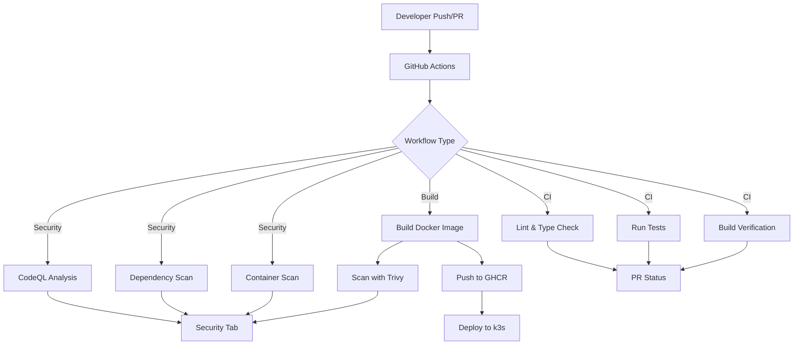

# Repository Template

<!-- Badges - Update these URLs after creating your repository -->
<!--
[](https://github.com/raolivei/PROJECT_NAME/actions/workflows/ci.yml)
[](https://github.com/raolivei/PROJECT_NAME/actions/workflows/security-scan.yml)
[](https://github.com/raolivei/PROJECT_NAME/actions/workflows/build-and-push.yml)
[](VERSION)
[](LICENSE)
-->

This is a secure, production-ready repository template following best practices for security, CI/CD, and code quality. Use this template to bootstrap new projects with comprehensive CI/CD pipelines, security scanning, and standardized workflows.

## Features

- ✅ **Security Scanning**: Automated vulnerability scanning for dependencies and containers (CodeQL, Trivy, dependency audits)
- ✅ **Branch Protection**: Enforced PR reviews and status checks with automated setup
- ✅ **CI/CD Pipelines**: Automated testing, building, and deployment workflows
- ✅ **Issue Templates**: Standardized templates for bugs, features, and infrastructure tasks
- ✅ **Project Boards**: GitHub Projects integration for issue and PR tracking
- ✅ **Label Management**: Automated label setup aligned with branch naming conventions
- ✅ **Multi-Component Support**: Build and push multiple Docker images (api, frontend, worker, etc.)
- ✅ **Dependency Management**: Automated dependency updates via Dependabot
- ✅ **Code Quality**: Linting, type checking, and testing workflows for Python, Node.js, and more
- ✅ **Container Security**: Docker image scanning with Trivy and vulnerability reporting
- ✅ **Semantic Versioning**: Automatic version extraction from VERSION file
- ✅ **Multi-Platform Builds**: Support for linux/amd64 and linux/arm64 architectures

## Quick Start

### Option 1: Automated Setup (Recommended)

```bash
# 1. Copy template to your new repository
cp -r repo-template/* /path/to/new-repo/

# 2. Run automated setup script
cd /path/to/new-repo
./scripts/setup-new-repo.sh PROJECT_NAME
```

### Option 2: Manual Setup

1. **Copy this template** to your new repository:

   ```bash
   cp -r repo-template/* /path/to/new-repo/
   ```

2. **Update configuration files**:

   ```bash
   cd /path/to/new-repo
   # Replace PROJECT_NAME in all files
   find . -type f -exec sed -i '' 's/PROJECT_NAME/your-project-name/g' {} \;
   ```

3. **Update specific files**:

   - `github/setup-branch-protection.sh`: Set `REPO_NAME`
   - `.github/workflows/build-and-push.yml`: Update `IMAGE_NAME` and paths
   - `.github/workflows/ci.yml`: Update paths and build contexts

4. **Set up GitHub Secrets**:

   - Go to repository Settings → Secrets and variables → Actions
   - Add `CR_PAT`: GitHub Container Registry Personal Access Token
     - Create token: GitHub Settings → Developer settings → Personal access tokens
     - Scopes: `write:packages`, `read:packages`

5. **Initialize version**:

   ```bash
   echo "0.1.0" > VERSION
   git add VERSION
   git commit -m "chore: initialize version"
   ```

6. **Run branch protection setup** (after first push):
   ```bash
   chmod +x github/setup-branch-protection.sh
   ./github/setup-branch-protection.sh
   ```

See [SETUP.md](SETUP.md) for detailed instructions.

## Project Structure

```
.
├── .github/
│   ├── workflows/              # CI/CD workflows
│   │   ├── security-scan.yml  # Security scanning (CodeQL, Trivy, dependency audits)
│   │   ├── build-and-push.yml # Docker build and push to GHCR
│   │   ├── ci.yml             # Continuous integration (lint, test, build)
│   │   └── README.md          # Workflow documentation
│   ├── ISSUE_TEMPLATE/        # Issue templates (bug, feature, infrastructure, security)
│   │   ├── bug_report.md      # Bug report template (maps to fix/ branches)
│   │   ├── feature_request.md # Feature request template (maps to feature/ branches)
│   │   ├── infrastructure.md  # Infrastructure task template (maps to infra/ branches)
│   │   ├── security_vulnerability.md # Security vulnerability template
│   │   ├── config.yml         # Template chooser configuration
│   │   └── README.md          # Issue linking and usage guide
│   └── labels.json            # Standardized label definitions
│   ├── CODEOWNERS             # Code ownership rules
│   ├── PULL_REQUEST_TEMPLATE.md  # PR template
│   ├── dependabot.yml         # Automated dependency updates
│   └── SECURITY.md            # Security policy
├── github/
│   ├── branch-protection-config.json  # Branch protection rules
│   ├── setup-branch-protection.sh     # Automated setup script
│   ├── setup-labels.sh                # Label setup script
│   ├── setup-project-board.sh         # Project board setup script
│   └── PROJECT_BOARDS.md               # Project board documentation
├── scripts/
│   └── setup-new-repo.sh      # Automated repository initialization
├── examples/                  # Example files (Dockerfile, k8s manifests, etc.)
├── .gitignore                 # Comprehensive ignore patterns
├── VERSION                     # Semantic version file (0.1.0)
├── CHANGELOG.md                # Change log (Keep a Changelog format)
├── CONTRIBUTING.md             # Contribution guidelines
├── LICENSE                     # License file (MIT)
└── README.md                   # This file
```

## Architecture Overview



## Workflow Details

### Security Scanning (`security-scan.yml`)

- **CodeQL Analysis**: Static code analysis for security vulnerabilities
- **Dependency Scanning**: npm audit and pip-audit for known vulnerabilities
- **Container Scanning**: Trivy scans Dockerfiles and images
- **Secret Detection**: Basic pattern matching for exposed secrets

**Triggers**: Every PR, push to main/dev, weekly schedule, manual

### Build & Push (`build-and-push.yml`)

- **Multi-Platform**: Builds for linux/amd64 and linux/arm64
- **Semantic Versioning**: Extracts version from VERSION file
- **Image Tagging**:
  - `main` branch → `main`, `latest`, `main-<sha>`
  - `dev` branch → `dev`, `dev-<sha>`
  - Git tags `v1.2.3` → `v1.2.3`, `v1.2`, `v1`, `<sha>`
  - PRs → `pr-<number>` (build only)
- **Post-Build Scanning**: Trivy vulnerability scan

**Triggers**: Push to main/dev, git tags `v*`, PRs (build only), manual

### CI (`ci.yml`)

- **Language Detection**: Automatically detects Python, Node.js projects
- **Linting**: ruff (Python), ESLint (Node.js)
- **Type Checking**: mypy (Python), TypeScript (Node.js)
- **Testing**: pytest (Python), npm test (Node.js)
- **Build Verification**: Docker image build test (no push)

**Triggers**: PRs to main/dev, push to dev, manual

## Image Tagging Strategy

| Trigger               | Tags Generated                  |
| --------------------- | ------------------------------- |
| Push to `main`        | `main`, `latest`, `main-<sha>`  |
| Push to `dev`         | `dev`, `dev-<sha>`              |
| Git tag `v1.2.3`      | `v1.2.3`, `v1.2`, `v1`, `<sha>` |
| Pull request #42      | `pr-42` (build only, no push)   |
| Manual with tag input | Custom tag                      |

## Examples

### Single-Component Project

For projects with a single Dockerfile at the root:

```yaml
# .github/workflows/build-and-push.yml
env:
  IMAGE_NAME: ghcr.io/raolivei/my-project
```

### Multi-Component Project

For projects with multiple components (api, frontend, etc.):

```yaml
# .github/workflows/build-and-push.yml
env:
  IMAGE_NAME_API: ghcr.io/raolivei/my-project-api
  IMAGE_NAME_FRONTEND: ghcr.io/raolivei/my-project-frontend
```

Then uncomment and customize the multi-component build jobs in the workflow.

## Troubleshooting

### Workflows Not Running

- Check YAML syntax using a validator
- Verify file paths in workflow triggers match your project structure
- Ensure workflow files are in `.github/workflows/` directory
- Check repository Actions tab for error messages

### Build Failures

- Verify Dockerfile exists and is valid
- Check build context paths are correct
- Ensure all dependencies are available
- Review workflow logs for specific errors

### Security Scans Failing

- **CodeQL**: Add your language to the matrix in `security-scan.yml`
- **Dependency Scan**: Ensure `package-lock.json` or `requirements.txt` exists
- **Container Scan**: Verify Dockerfile exists and is accessible

### Branch Protection Setup Fails

- Verify GitHub CLI is installed: `gh --version`
- Check authentication: `gh auth status`
- Ensure you have admin access to the repository
- Verify repository exists on GitHub before running setup

## Documentation

- **[SETUP.md](SETUP.md)**: Detailed setup instructions
- **[CONTRIBUTING.md](CONTRIBUTING.md)**: Contribution guidelines
- **[TEMPLATE_VARIABLES.md](TEMPLATE_VARIABLES.md)**: All placeholder variables
- **[QUICK_REFERENCE.md](QUICK_REFERENCE.md)**: Quick command reference
- **[.github/workflows/README.md](.github/workflows/README.md)**: Workflow documentation

## License

This template is licensed under the MIT License. See [LICENSE](LICENSE) for details.

## Support

For issues or questions:

1. Check workflow logs in GitHub Actions
2. Review [SETUP.md](SETUP.md) troubleshooting section
3. Consult [QUICK_REFERENCE.md](QUICK_REFERENCE.md) for common commands
4. Review workflow-specific documentation in `.github/workflows/README.md`
